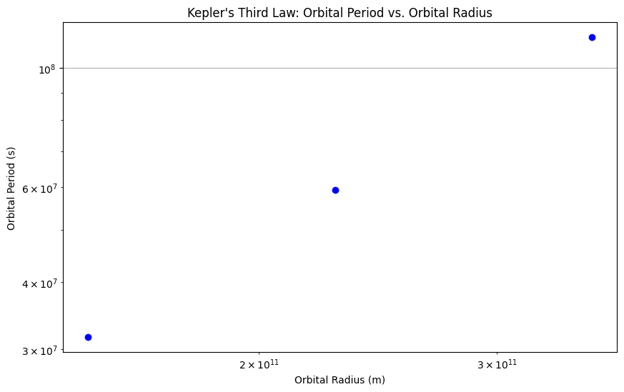

# Problem 2
# Cosmic Velocities: Understanding Escape and Orbital Dynamics

## Introduction

The concept of cosmic velocities is fundamental in astrophysics and space exploration. These velocities define the thresholds for different types of motion in relation to celestial bodies. Specifically, the first, second, and third cosmic velocities correspond to the speeds required for orbiting a celestial body, escaping its gravitational influence, and leaving a star system, respectively. Understanding these velocities is crucial for planning space missions, launching satellites, and exploring other planets.

## Definitions of Cosmic Velocities

1. **First Cosmic Velocity (Orbital Velocity)**:
   The first cosmic velocity is the minimum speed required for an object to maintain a stable orbit around a celestial body. It is given by the formula:

   $$
   v_1 = \sqrt{\frac{G M}{r}}
   $$

   where:
   - \( v_1 \) is the first cosmic velocity,
   - \( G \) is the gravitational constant (\(6.67430 \times 10^{-11} \, \text{m}^3/\text{kg} \cdot \text{s}^2\)),
   - \( M \) is the mass of the celestial body,
   - \( r \) is the radius from the center of the celestial body to the object in orbit.

2. **Second Cosmic Velocity (Escape Velocity)**:
   The second cosmic velocity is the minimum speed required for an object to break free from the gravitational pull of a celestial body without any further propulsion. It is given by:

   $$
   v_2 = \sqrt{\frac{2 G M}{r}}
   $$

   where:
   - \( v_2 \) is the second cosmic velocity.

3. **Third Cosmic Velocity (Heliocentric Escape Velocity)**:
   The third cosmic velocity is the speed required to escape the gravitational influence of a star (e.g., the Sun) and enter interstellar space. It is calculated as:

   $$
   v_3 = \sqrt{\frac{G M_{\text{star}}}{d} + v_2^2}
   $$

   where:
   - \( v_3 \) is the third cosmic velocity,
   - \( M_{\text{star}} \) is the mass of the star,
   - \( d \) is the distance from the star.

## Mathematical Derivations and Parameters

The derivations of these velocities are based on the principles of gravitational force and kinetic energy. The gravitational potential energy \( U \) of an object at a distance \( r \) from the center of a celestial body is given by:

$$
U = -\frac{G M m}{r}
$$

where \( m \) is the mass of the object. For an object to escape the gravitational influence, its kinetic energy \( K \) must be equal to or greater than the absolute value of the gravitational potential energy:

$$
K \geq |U|
$$

The kinetic energy is given by:

$$
K = \frac{1}{2} m v^2
$$

By equating the kinetic energy to the gravitational potential energy, we derive the escape velocity.

## Calculation of Cosmic Velocities for Different Celestial Bodies

Let's calculate the first, second, and third cosmic velocities for Earth, Mars, and Jupiter. The following parameters will be used:

- **Earth**: 
  - Mass \( M = 5.972 \times 10^{24} \, \text{kg} \)
  - Radius \( r = 6.371 \times 10^{6} \, \text{m} \)

- **Mars**: 
  - Mass \( M = 6.4171 \times 10^{23} \, \text{kg} \)
  - Radius \( r = 3.3895 \times 10^{6} \, \text{m} \)

- **Jupiter**: 
  - Mass \( M = 1.898 \times 10^{27} \, \text{kg} \)
  - Radius \( r = 6.9911 \times 10^{7} \, \text{m} \)

### Python Script for Calculations and Visualization



## Importance in Space Exploration

1. **Launching Satellites**: The first cosmic velocity is crucial for launching satellites into orbit. Understanding this velocity helps engineers design rockets that can achieve the necessary speed to maintain a stable orbit.

2. **Interplanetary Missions**: The second cosmic velocity is essential for missions aimed at escaping a planet's gravitational influence. For example, spacecraft must reach this velocity to leave Earth and travel to other planets.

3. **Interstellar Travel**: The third cosmic velocity is a theoretical concept that would be necessary for interstellar travel. While current technology does not allow for such speeds, understanding this velocity is vital for future exploration beyond our solar system.

## Conclusion

The first, second, and third cosmic velocities are fundamental concepts in astrophysics that define the thresholds for orbital motion, escape from gravitational influence, and interstellar travel. By calculating and visualizing these velocities for different celestial bodies, we gain insights into the dynamics of space exploration and the challenges associated with launching missions beyond our planet.
```
