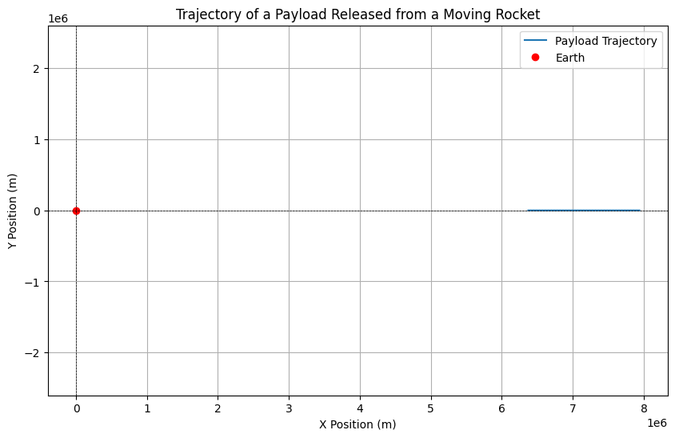

# Problem 3
# Analyzing Trajectories of a Payload Released from a Moving Rocket Near Earth

## Introduction

When a payload is released from a moving rocket near Earth, its trajectory is influenced by its initial conditions, including position, velocity, and altitude, as well as the gravitational forces acting upon it. This scenario is crucial for understanding various space mission operations, such as deploying satellites, returning objects to Earth, or performing orbital maneuvers. This document analyzes the possible trajectories of a payload and provides a computational tool to simulate and visualize its motion under Earth's gravity.

## Trajectory Types

The trajectory of a payload can be classified into several types based on its energy and initial conditions:

1. **Elliptical Trajectory**: If the payload's velocity is less than the escape velocity, it will follow an elliptical path around Earth. This is typical for objects in stable orbits.

2. **Parabolic Trajectory**: If the payload's velocity is exactly equal to the escape velocity, it will follow a parabolic trajectory. This represents the boundary between bound and unbound orbits.

3. **Hyperbolic Trajectory**: If the payload's velocity exceeds the escape velocity, it will follow a hyperbolic path, indicating that it is escaping Earth's gravitational influence.

### Gravitational Principles

The motion of the payload can be described using Newton's Law of Gravitation:

$$
F = \frac{G M m}{r^2}
$$

where:
- \( F \) is the gravitational force,
- \( G \) is the gravitational constant (\(6.67430 \times 10^{-11} \, \text{m}^3/\text{kg} \cdot \text{s}^2\)),
- \( M \) is the mass of Earth (\(5.972 \times 10^{24} \, \text{kg}\)),
- \( m \) is the mass of the payload,
- \( r \) is the distance from the center of Earth to the payload.

The acceleration due to gravity \( g \) at a distance \( r \) from the center of Earth is given by:

$$
g = \frac{G M}{r^2}
$$

## Numerical Analysis of Payload Trajectories

To compute the path of the payload based on given initial conditions, we can use numerical methods such as the Euler method or the Runge-Kutta method. For this simulation, we will use the Euler method to update the position and velocity of the payload over time.

### Initial Conditions

For our simulation, we will define the following initial conditions:
- Initial position: \( (x_0, y_0) \)
- Initial velocity: \( (v_{x0}, v_{y0}) \)
- Altitude: \( h \) (above Earth's surface)

### Python Script for Simulation

Below is a Python script that simulates the motion of a payload released from a moving rocket near Earth. The script uses the Euler method to compute the trajectory based on the initial conditions.

## Discussion of Trajectories

### Orbital Insertion

When a payload is released with a velocity less than the escape velocity, it may enter an elliptical orbit around Earth. This is crucial for satellite deployment, where the payload must achieve a specific velocity and trajectory to remain in orbit.

### Reentry Scenarios

If the payload is released with a velocity that allows it to descend back to Earth, it will follow a parabolic or elliptical trajectory, depending on its initial speed. Understanding these trajectories is vital for planning reentry missions, ensuring that the payload can safely return to the surface.

### Escape Scenarios

For payloads intended to escape Earth's gravitational influence, they must be released with a velocity greater than the escape velocity. This trajectory will be hyperbolic, allowing the payload to leave the Earth-Moon system and potentially travel to other celestial bodies.

## Conclusion

The analysis of trajectories for a payload released from a moving rocket near Earth reveals the complexities of orbital mechanics and gravitational influences. By simulating the motion of the payload under Earth's gravity, we gain insights into various space mission scenarios, including satellite deployment, reentry, and escape trajectories. This understanding is essential for successful space exploration and mission planning.
