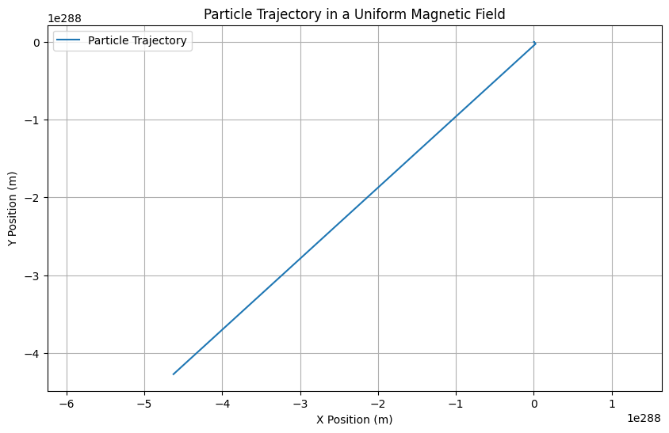
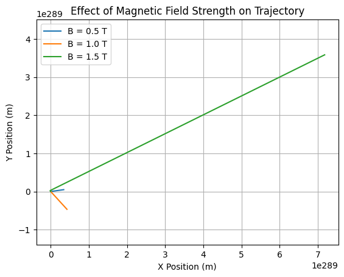

# Problem 1
# Exploring the Lorentz Force and Particle Motion Simulations

## 1. Exploration of Applications

The Lorentz force is a fundamental concept in electromagnetism that describes the force experienced by a charged particle moving in electric and magnetic fields. It is mathematically expressed as:

$$
\mathbf{F} = q(\mathbf{E} + \mathbf{v} \times \mathbf{B})
$$

where:
- \( \mathbf{F} \) is the Lorentz force,
- \( q \) is the charge of the particle,
- \( \mathbf{E} \) is the electric field,
- \( \mathbf{v} \) is the velocity of the particle,
- \( \mathbf{B} \) is the magnetic field.

### Key Systems Utilizing the Lorentz Force

1. **Particle Accelerators**: Devices like cyclotrons and synchrotrons use magnetic fields to bend the paths of charged particles, allowing them to gain energy and collide at high speeds.

2. **Mass Spectrometers**: These instruments utilize electric and magnetic fields to separate ions based on their mass-to-charge ratio, enabling the analysis of chemical compositions.

3. **Plasma Confinement**: In fusion reactors, magnetic confinement systems (like tokamaks) use the Lorentz force to contain hot plasma, preventing it from coming into contact with the reactor walls.

### Relevance of Electric and Magnetic Fields

- **Electric Fields (\( \mathbf{E} \))**: They exert a force on charged particles, accelerating them in the direction of the field. This is crucial for initial particle acceleration in devices like accelerators.

- **Magnetic Fields (\( \mathbf{B} \))**: They influence the trajectory of charged particles, causing them to move in circular or helical paths. This is essential for maintaining particle confinement in accelerators and plasma devices.

## 2. Simulating Particle Motion

We will implement a simulation to compute and visualize the trajectory of a charged particle under different field configurations.

### Simulation Setup

We will use the following scenarios:
1. A uniform magnetic field.
2. Combined uniform electric and magnetic fields.
3. Crossed electric and magnetic fields.

### Python Implementation




## 3. Parameter Exploration

To explore how different parameters influence the trajectory, we can vary:
- **Field strengths**: Adjust \( E \) and \( B \) values.
- **Initial particle velocity**: Change the components of \( \mathbf{v} \).
- **Charge and mass of the particle**: Modify \( q \) and \( m \).

### Example of Parameter Variation


## 4. Visualization

The plots generated from the simulations will illustrate the particle's path in both 2D and 3D. Key physical phenomena such as the Larmor radius and drift velocity can be highlighted.

### Larmor Radius

The Larmor radius \( r_L \) can be calculated using:

$$
r_L = \frac{mv}{|q|B}
$$

where \( v \) is the speed of the particle. This radius indicates the size of the circular motion of the particle in a magnetic field.

### Drift Velocity

In crossed fields, the drift velocity \( \mathbf{v}_d \) can be expressed as:

$$
\mathbf{v}_d = \frac{\mathbf{E} \times \mathbf{B}}{B^2}
$$

This drift motion is crucial in understanding the behavior of particles in magnetic confinement systems.

## Discussion

The results of our simulations can be directly related to practical systems such as cyclotrons, where charged particles are accelerated in circular paths by magnetic fields. The ability to visualize and manipulate parameters allows for a deeper understanding of how charged particles behave in various electromagnetic environments.

### Suggestions for Extension

Future work could include:
- Simulating non-uniform magnetic fields.
- Incorporating relativistic effects for high-speed particles.
- Exploring the effects of collisions between particles in a plasma.

By extending the simulation capabilities, we can gain further insights into complex systems in plasma physics and astrophysics.
```
