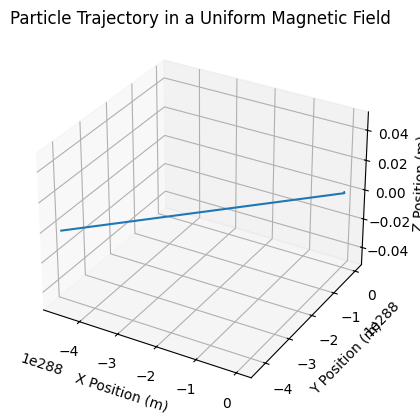

# Problem 1
# Simulating the Effects of the Lorentz Force

## 1. Exploration of Applications

The Lorentz force is a fundamental concept in electromagnetism that describes the force experienced by a charged particle moving through electric and magnetic fields. The force can be expressed mathematically as:

$$
\mathbf{F} = q(\mathbf{E} + \mathbf{v} \times \mathbf{B})
$$

where:
- \( \mathbf{F} \) is the Lorentz force,
- \( q \) is the charge of the particle,
- \( \mathbf{E} \) is the electric field,
- \( \mathbf{v} \) is the velocity of the particle,
- \( \mathbf{B} \) is the magnetic field.

### Key Systems Utilizing the Lorentz Force

1. **Particle Accelerators**: Devices like cyclotrons and synchrotrons use magnetic fields to steer and accelerate charged particles to high speeds for collision experiments or medical applications.
  
2. **Mass Spectrometers**: These instruments utilize the Lorentz force to separate ions based on their mass-to-charge ratio, allowing for precise identification of chemical compounds.

3. **Plasma Confinement**: In fusion reactors, magnetic confinement systems use the Lorentz force to contain hot plasma, preventing it from coming into contact with reactor walls.

### Relevance of Electric and Magnetic Fields

- **Electric Fields (\( \mathbf{E} \))**: They exert a force on charged particles, accelerating them in the direction of the field.
- **Magnetic Fields (\( \mathbf{B} \))**: They influence the trajectory of moving charges, causing them to move in circular or helical paths, depending on their velocity and the orientation of the field.

## 2. Simulating Particle Motion

### Simulation Setup

We will implement a simulation to compute and visualize the trajectory of a charged particle under various field configurations. The simulation will cover:

1. A uniform magnetic field.
2. Combined uniform electric and magnetic fields.
3. Crossed electric and magnetic fields.

### Equations of Motion

The equations of motion for a charged particle under the influence of the Lorentz force can be expressed as:

$$
\frac{d\mathbf{p}}{dt} = q(\mathbf{E} + \mathbf{v} \times \mathbf{B})
$$

where \( \mathbf{p} \) is the momentum of the particle, which can be related to its velocity \( \mathbf{v} \) by:

$$
\mathbf{p} = m\mathbf{v}
$$

### Numerical Integration

We will use the Euler method for numerical integration to update the position and velocity of the particle over time.

### Python Implementation

Below is the Python code for simulating the motion of a charged particle under the specified conditions.

```python

```

## 3. Parameter Exploration

To explore how variations in parameters influence the trajectory, we can modify:

- **Field Strengths**: Change the values of \( \mathbf{E} \) and \( \mathbf{B} \).
- **Initial Particle Velocity**: Adjust the initial velocity vector.
- **Charge and Mass of the Particle**: Experiment with different values for \( q \) and \( m \).

### Example Modifications

1. **Increasing Magnetic Field Strength**: Set \( B = [0.0, 0.0, 2.0] \) T.
2. **Adding Electric Field**: Set \( E = [0.0, 1.0, 0.0] \) V/m.
3. **Changing Initial Velocity**: Set \( initial_velocity = [1e6, 1e6, 0.0] \) m/s.

## 4. Visualization

The simulation produces a 3D plot of the particle's trajectory. The path can exhibit circular, helical, or drift motion depending on the field configurations and initial conditions.

### Physical Phenomena

- **Larmor Radius**: The radius of the circular motion of the particle in a magnetic field can be calculated as:

$$
r_L = \frac{mv}{|q|B}
$$

- **Drift Velocity**: In crossed fields, the particle experiences a drift velocity given by:

$$
\mathbf{v}_d = \frac{\mathbf{E} \times \mathbf{B}}{B^2}
$$

## Conclusion

This simulation provides a clear understanding of the Lorentz force's effects on charged particles in various electromagnetic field configurations. The results can be related to practical systems such as cyclotrons and magnetic traps, where controlling particle motion is crucial for achieving desired outcomes.

### Suggestions for Extension

- Implement non-uniform electric and magnetic fields.
- Explore relativistic effects for high-speed particles.
- Simulate interactions between multiple charged particles.

This Markdown document can be copied and pasted into Visual Studio for further development and testing.