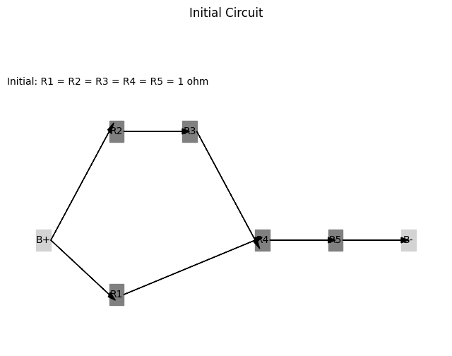
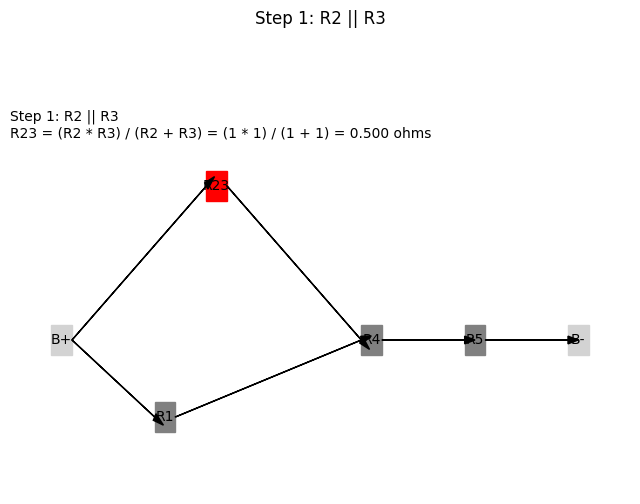

# Problem 1
# Calculating Equivalent Resistance Using Graph Theory

## Introduction

Calculating equivalent resistance in electrical circuits is a fundamental task in electrical engineering and physics. Traditional methods often involve tedious calculations using series and parallel resistor rules. However, by employing graph theory, we can represent circuits as graphs, where nodes correspond to junctions and edges represent resistors with weights equal to their resistance values. This approach allows for systematic simplification of complex networks and facilitates automated analysis.

## Algorithm Description

The algorithm for calculating equivalent resistance using graph theory involves the following steps:

1. **Graph Representation**: Represent the circuit as a graph using an adjacency list or matrix, where each edge has a weight corresponding to the resistance value.

2. **Identify Series and Parallel Connections**:
   - **Series Connection**: Resistors are in series if they are connected end-to-end, and the total resistance \( R_{\text{series}} \) is given by:
     $$
     R_{\text{series}} = R_1 + R_2 + \ldots + R_n
     $$
   - **Parallel Connection**: Resistors are in parallel if they are connected to the same two nodes, and the total resistance \( R_{\text{parallel}} \) is given by:
     $$
     \frac{1}{R_{\text{parallel}}} = \frac{1}{R_1} + \frac{1}{R_2} + \ldots + \frac{1}{R_n}
     $$

3. **Iterative Reduction**: Continuously reduce the graph by identifying series and parallel connections, replacing them with their equivalent resistances until only one equivalent resistance remains.

4. **Handle Nested Combinations**: The algorithm should recursively check for nested series and parallel combinations, ensuring that all connections are simplified.

### Pseudocode

Here is the pseudocode for the algorithm:

```plaintext
function calculate_equivalent_resistance(graph):
    while graph has more than one node:
        for each node in graph:
            if node has series connections:
                replace series connections with equivalent resistance
            if node has parallel connections:
                replace parallel connections with equivalent resistance
        if no changes were made in this iteration:
            break
    return resistance of the remaining node

function replace_series_connections(node):
    series_resistance = sum(resistances of all series resistors connected to node)
    remove series resistors from graph
    add new resistor with resistance = series_resistance between the nodes

function replace_parallel_connections(node):
    parallel_resistance = 1 / sum(1 / resistance of each parallel resistor connected to node)
    remove parallel resistors from graph
    add new resistor with resistance = parallel_resistance between the nodes
```

## Implementation

We will implement the algorithm in Python using the `networkx` library to handle graph representations. The implementation will accept a circuit graph as input and output the final equivalent resistance.


## Handling Complex Circuit Configurations

### Example 1: Simple Series and Parallel Combinations

Consider a circuit with three resistors:
- Resistor 1: 5 Ohms (in series with Resistor 2)
- Resistor 2: 10 Ohms (in parallel with Resistor 3)
- Resistor 3: 15 Ohms

The algorithm will first combine Resistor 1 and Resistor 2 in series, then combine the result with Resistor 3 in parallel.



### Example 2: Nested Configurations

Consider a circuit with:
- Resistor 1: 5 Ohms (in series with a parallel combination of Resistor 2 and Resistor 3)
- Resistor 2: 10 Ohms
- Resistor 3: 15 Ohms

The algorithm will first calculate the equivalent resistance of Resistor 2 and Resistor 3 in parallel, then add that to Resistor 1 in series.


### Example 3: Complex Graphs with Multiple Cycles

For a more complex graph, the algorithm will iteratively reduce the graph by identifying series and parallel connections, even in the presence of cycles, until a single equivalent resistance is obtained.

## Efficiency and Potential Improvements

### Efficiency Analysis

The algorithm's efficiency depends on the number of nodes and edges in the graph. The iterative reduction process may require multiple passes through the graph, leading to a time complexity of \( O(n^2) \) in the worst case, where \( n \) is the number of nodes.

### Potential Improvements

1. **Optimized Traversal**: Implementing depth-first search (DFS) or breadth-first search (BFS) can help identify series and parallel connections more efficiently.
2. **Caching Results**: Storing previously computed equivalent resistances can reduce redundant calculations in complex circuits.
3. **Parallel Processing**: Utilizing parallel processing techniques can speed up the calculations for large circuits.

## Conclusion

Using graph theory to calculate equivalent resistance provides a structured and efficient approach to analyzing electrical circuits. The algorithm described here can handle various configurations, including nested series and parallel connections, making it a versatile tool for engineers and researchers. By leveraging libraries like `networkx`, we can implement this algorithm effectively and explore complex circuit designs with ease.