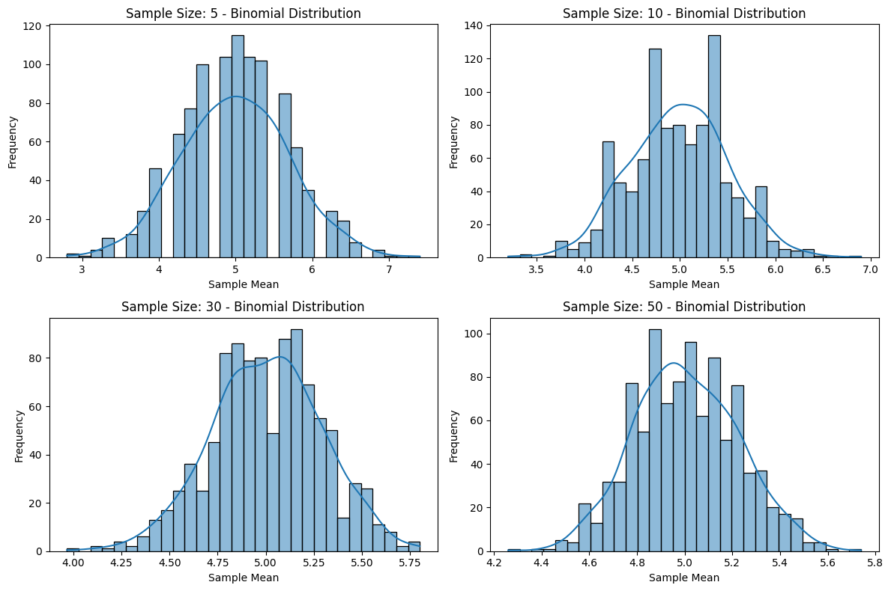

# Problem 1
# Exploring the Central Limit Theorem through Simulation

## Introduction

The Central Limit Theorem (CLT) is a fundamental principle in statistics that states that the distribution of the sample mean will approach a normal distribution as the sample size increases, regardless of the shape of the population distribution. This property is crucial for making inferences about population parameters based on sample statistics. In this document, we will simulate various population distributions, sample from them, and visualize the resulting sampling distributions of the sample mean to observe the convergence to normality.

## 1. Simulating Sampling Distributions

We will explore three types of population distributions:

1. **Uniform Distribution**: A distribution where all outcomes are equally likely within a specified range.
2. **Exponential Distribution**: A distribution often used to model time until an event occurs, characterized by its rate parameter.
3. **Binomial Distribution**: A discrete distribution representing the number of successes in a fixed number of independent Bernoulli trials.

# 2. Sampling and Visualization

Next, we will randomly sample data from each population and calculate the sample mean for different sample sizes (e.g., 5, 10, 30, 50). We will repeat this process multiple times to create a sampling distribution of the sample mean.

## Plotting Histograms of Sample Means

Now, we will plot histograms of the sample means for each sample size and observe the convergence to a normal distribution.

n of Sample Mean (n={size}, {distribution_name.capitalize()} Distribution)')

## 3. Parameter Exploration

### Influence of Original Distribution and Sample Size

The shape of the original distribution and the sample size significantly influence the rate of convergence to normality. As the sample size increases, the sampling distribution of the sample mean becomes more normally distributed, regardless of the original distribution's shape.

- **Uniform Distribution**: The sample means converge to normality relatively quickly due to the equal likelihood of outcomes.
- **Exponential Distribution**: The sample means also converge to normality, but the convergence may take slightly longer due to the skewness of the original distribution.
- **Binomial Distribution**: The sample means converge to normality as well, especially when the number of trials is large.

### Impact of Population Variance

The variance of the population affects the spread of the sampling distribution. According to the CLT, the standard deviation of the sampling distribution of the sample mean (also known as the standard error) is given by:

$$
\sigma_{\bar{x}} = \frac{\sigma}{\sqrt{n}}
$$

where:
- \( \sigma \) is the population standard deviation,
- \( n \) is the sample size.

As the sample size increases, the standard error decreases, leading to a tighter distribution of sample means.

## 4. Practical Applications

The Central Limit Theorem has several important applications in real-world scenarios:

1. **Estimating Population Parameters**: The CLT allows statisticians to make inferences about population means based on sample means, even when the population distribution is unknown.
  
2. **Quality Control in Manufacturing**: In quality control processes, the CLT helps in determining whether a production process is in control by analyzing sample means of product measurements.

3. **Predicting Outcomes in Financial Models**: Financial analysts use the CLT to model the behavior of asset returns, allowing for better risk assessment and decision-making.

## Conclusion

Through this simulation, we have observed the Central Limit Theorem in action, demonstrating how the sampling distribution of the sample mean approaches normality as the sample size increases, regardless of the original population distribution. This understanding is crucial for making statistical inferences and has wide-ranging applications in various fields.

### Suggestions for Further Exploration

- Experiment with other distributions, such as Poisson or normal distributions.
- Investigate the effects of different sampling methods (e.g., stratified sampling)