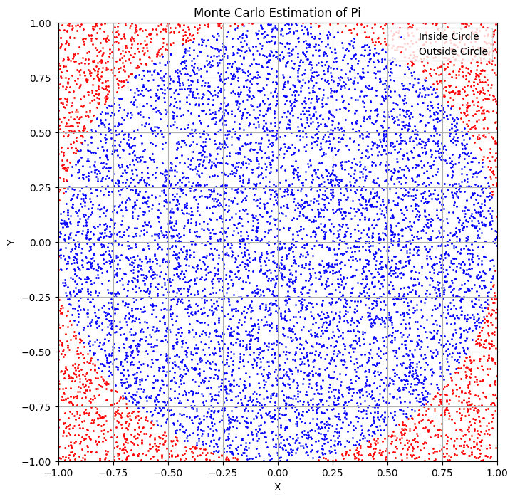
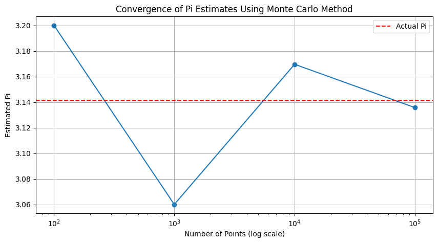
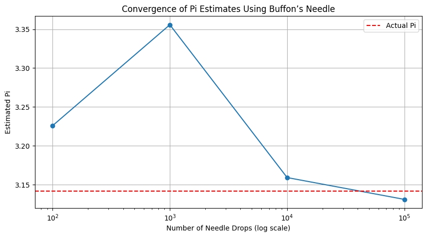

# Problem 2
# Estimating Pi Using Monte Carlo Methods

## Introduction

Monte Carlo simulations are a powerful computational technique that leverages randomness to solve problems or estimate values. One of the most elegant applications of Monte Carlo methods is estimating the value of \( \pi \) through geometric probability. By randomly generating points and analyzing their positions relative to geometric shapes, we can approximate \( \pi \) in an intuitive and visually engaging manner. This document will explore two methods for estimating \( \pi \): using a circle and Buffon’s Needle.

## Part 1: Estimating \( \pi \) Using a Circle

### 1. Theoretical Foundation

To estimate \( \pi \) using a circle, we can utilize the relationship between the area of a circle and the area of a square. 

- **Unit Circle**: The area of a unit circle (radius = 1) is given by:

$$
A_{\text{circle}} = \pi r^2 = \pi \cdot 1^2 = \pi
$$

- **Bounding Square**: The area of the square that bounds the unit circle (with side length 2) is:

$$
A_{\text{square}} = (2r)^2 = (2 \cdot 1)^2 = 4
$$

The ratio of the area of the circle to the area of the square is:

$$
\frac{A_{\text{circle}}}{A_{\text{square}}} = \frac{\pi}{4}
$$

If we randomly generate points within the square, the ratio of points that fall inside the circle to the total number of points will approximate this ratio:

$$
\frac{\text{Number of points inside the circle}}{\text{Total number of points}} \approx \frac{\pi}{4}
$$

From this, we can derive the formula for estimating \( \pi \):

$$
\pi \approx 4 \cdot \frac{\text{Number of points inside the circle}}{\text{Total number of points}}
$$

### 2. Simulation

We will generate random points in a 2D square bounding a unit circle and count how many fall inside the circle.

### 3. Visualization

We will create a plot showing the randomly generated points, distinguishing those inside and outside the circle.

### 4. Analysis

To investigate how the accuracy of the estimate improves as the number of points increases, we can run the simulation multiple times with increasing sample sizes and record the estimates of \( \pi \).

## Part 2: Estimating \( \pi \) Using Buffon’s Needle

### 1. Theoretical Foundation

Buffon’s Needle problem provides another method for estimating \( \pi \). The problem involves dropping a needle of length \( L \) onto a plane with parallel lines spaced \( D \) apart. The probability \( P \) that the needle crosses a line is given by:

$$
P = \frac{2L}{\pi D}
$$

From this, we can derive the formula for estimating \( \pi \):

$$
\pi \approx \frac{2L \cdot N}{D \cdot C}
$$

where:
- \( N \) is the total number of needle drops,
- \( C \) is the number of times the needle crosses a line.

### 2. Simulation

We will simulate the random dropping of a needle on a plane with parallel lines and count how many times the needle crosses a line.

### 4. Analysis

To explore how the number of needle drops affects the estimate’s accuracy, we can run the simulation multiple times with increasing sample sizes and record the estimates of \( \pi \).

## Conclusion

In this document, we explored two methods for estimating \( \pi \) using Monte Carlo simulations: the circle-based method and Buffon’s Needle. Both methods demonstrate the power of randomness in estimating mathematical constants and provide insights into convergence rates and computational efficiency.

### Comparison of Methods

- **Circle-Based Method**: 
  - Simpler to implement and visualize.
  - Convergence is generally faster with larger sample sizes.
  
- **Buffon’s Needle**: 
  - More complex due to geometric considerations.
  - Provides an interesting historical perspective on probability and geometry.

Both methods highlight the versatility of Monte Carlo simulations in solving complex problems and estimating values through randomness.

